<p align="center"></p>

<h1 align="center">Countersign</h1>

<p align="center">
  <b>Native macOS approval panel for every Claude Code, Codex, Cursor and Antigravity session.</b><br>
  Stop coming back to an agent that has waited an hour for your approval. Countersign shows each
  request as soon as you pause; you countersign it once, deliberately, without losing your place.
</p>

<p align="center">
  <a href="https://github.com/Gord1y/countersign/releases"></a>
  
  <a href="LICENSE"></a>
  <a href="https://cla-assistant.io/Gord1y/countersign"></a>
</p>

<p align="center">
  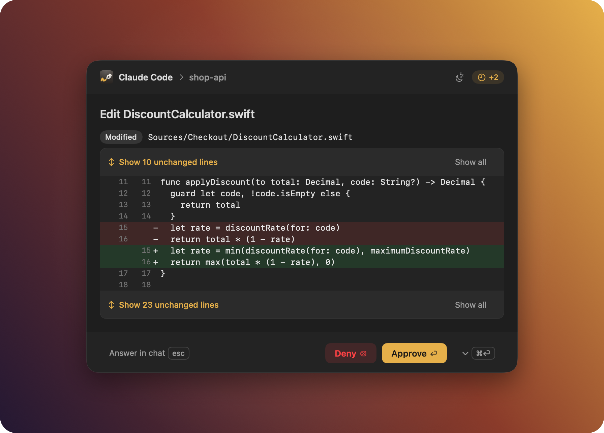
</p>

## Install

macOS 14 Sonoma or later. Both install the prebuilt release; no Xcode needed.

With Homebrew:

```sh
brew install gord1y/tap/countersign
```

Or with the install script, which asks whether to add the menu-bar app and whether to open setup
when it's done:

```sh
curl -fsSL https://raw.githubusercontent.com/Gord1y/countersign/main/install.sh | sh
```

Older versions, installs without questions and building from source:
[Install options](docs/setup.md#install-options).

## Set up

The install script offers to open Countersign for you; after Homebrew, run `countersign setup`.
Either way, wire the agents you use: the window shows each change before writing it and backs up
every file it changes, and `countersign setup --cli` does the same in the terminal. Codex asks you
to trust a new hook once: run `/hooks` in Codex and approve it. What setup changes and how to undo
it: [docs/setup.md](docs/setup.md).

---

## What it is

Run three or four agent chats at once and permission prompts arrive from everywhere. Native dialogs
stack, grab focus while you type, and a stray <kbd>Return</kbd> approves a command you never read.

Countersign answers them from one panel instead. Requests from every session and every agent wait
in one queue and appear one at a time, only once you stop typing. While a panel is up your keys go
to it and nowhere else, and when you answer in Claude Code's chat instead, its panel quietly
disappears.

Each prompt starts a short-lived `countersign hook` that either answers or steps aside, so there is
no service to keep alive, and any error leaves your agent's own prompt in charge. What it reads,
writes and sends: [Safety and privacy](docs/safety-and-privacy.md).

## Screenshots

<table>
  <tr>
    <td width="50%">
      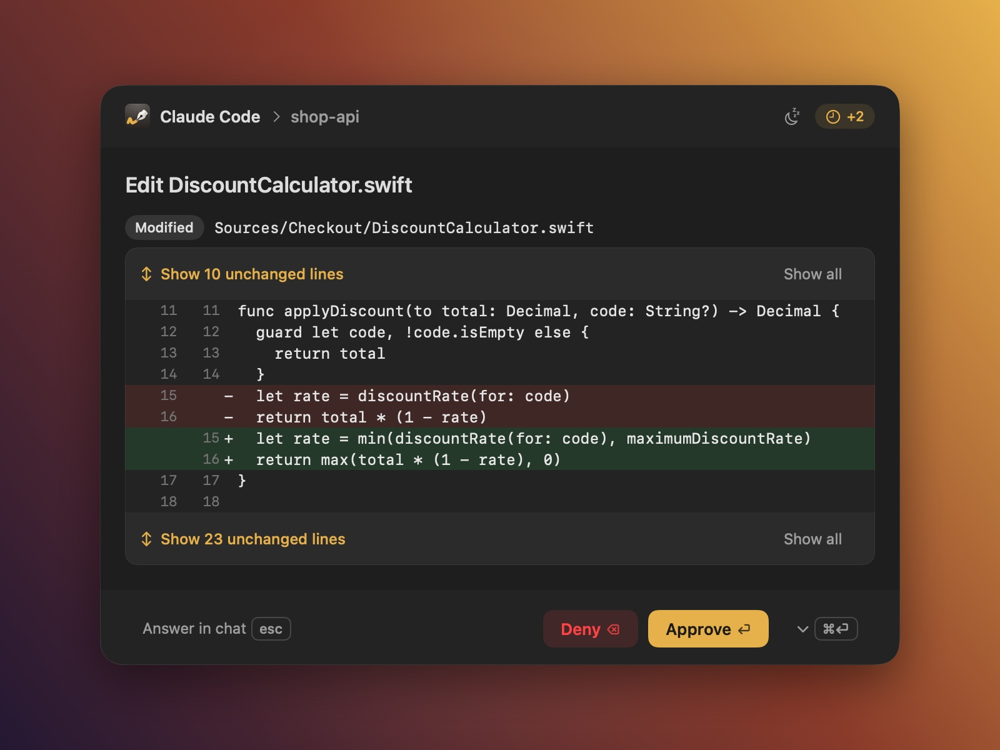<br>
      <b>Edits in context.</b> The enclosing block, real line numbers, expandable gaps.
    </td>
    <td width="50%">
      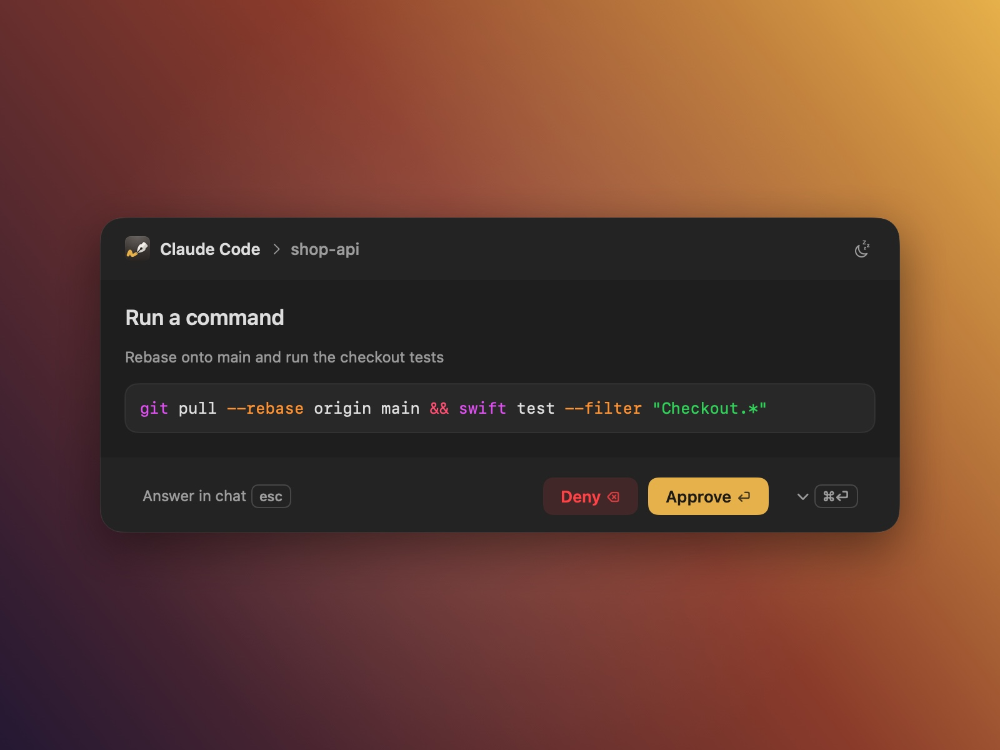<br>
      <b>Commands.</b> Highlighted shell, the agent's own description, Approve ▾ rules.
    </td>
  </tr>
  <tr>
    <td>
      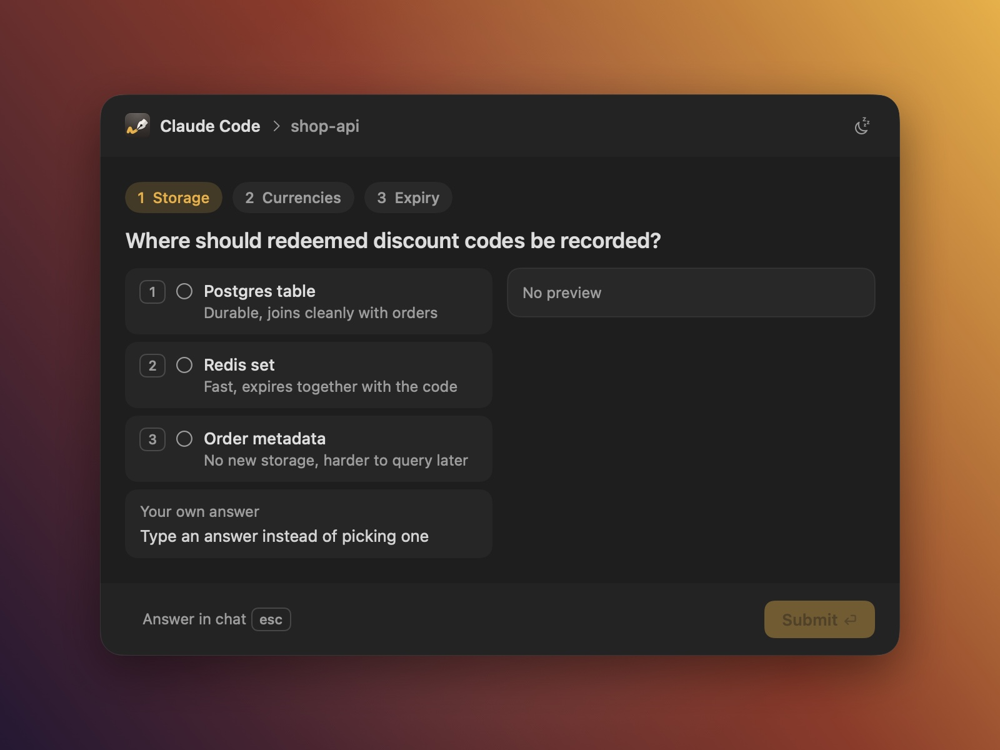<br>
      <b>Questions.</b> Tabs, number keys, multi-select, Other and an optional note.
    </td>
    <td>
      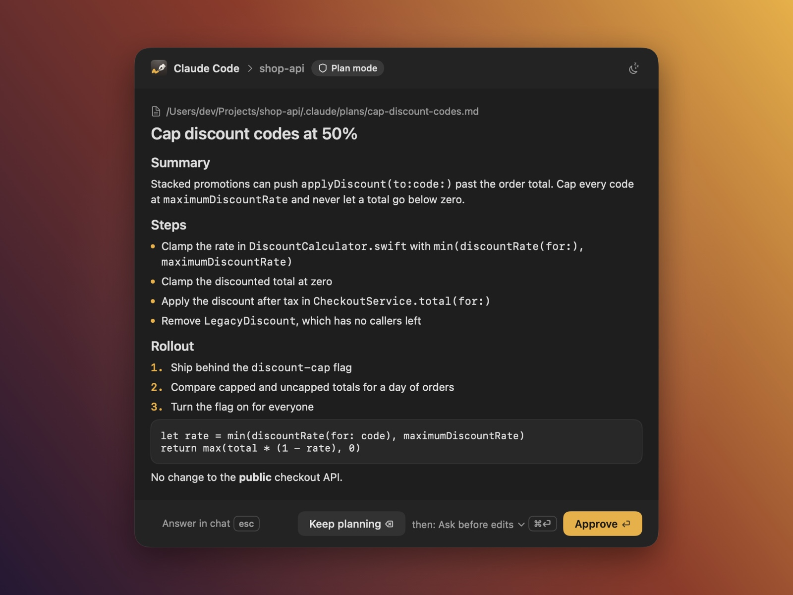<br>
      <b>Plans.</b> Markdown, "Keep planning" feedback, the mode to continue in.
    </td>
  </tr>
  <tr>
    <td>
      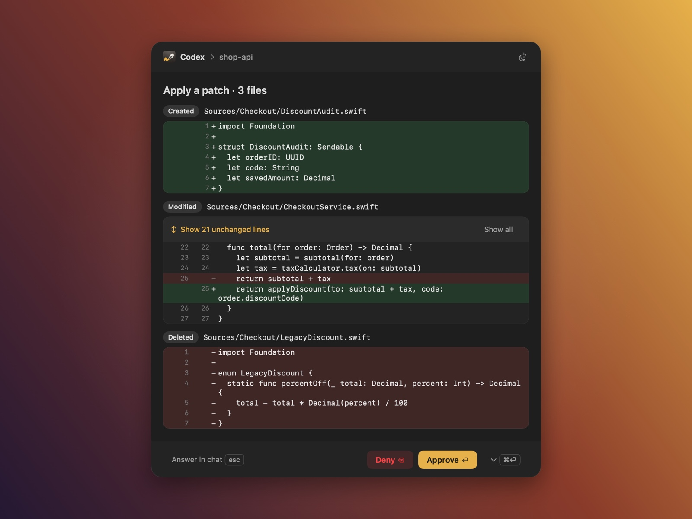<br>
      <b>Codex too.</b> Commands and <code>apply_patch</code> edits, with the same real-file context.
    </td>
    <td>
      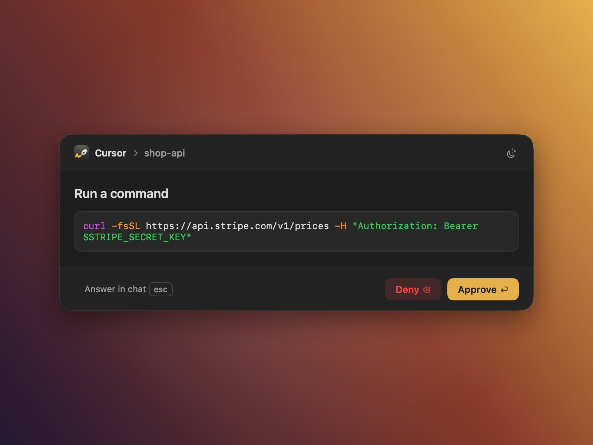<br>
      <b>Cursor too.</b> Shell commands outside Cursor's sandbox, and every MCP tool call.
    </td>
  </tr>
  <tr>
    <td>
      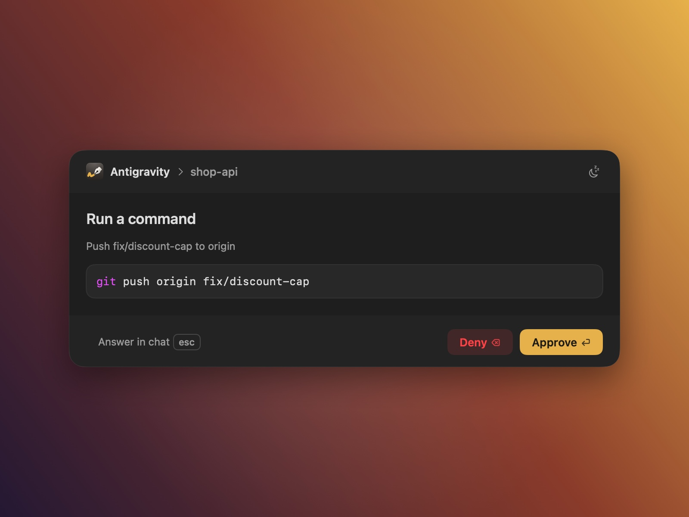<br>
      <b>Antigravity too.</b> Commands and MCP tool calls, same panel (see <a href="docs/limitations.md">Limitations</a>).
    </td>
    <td>
      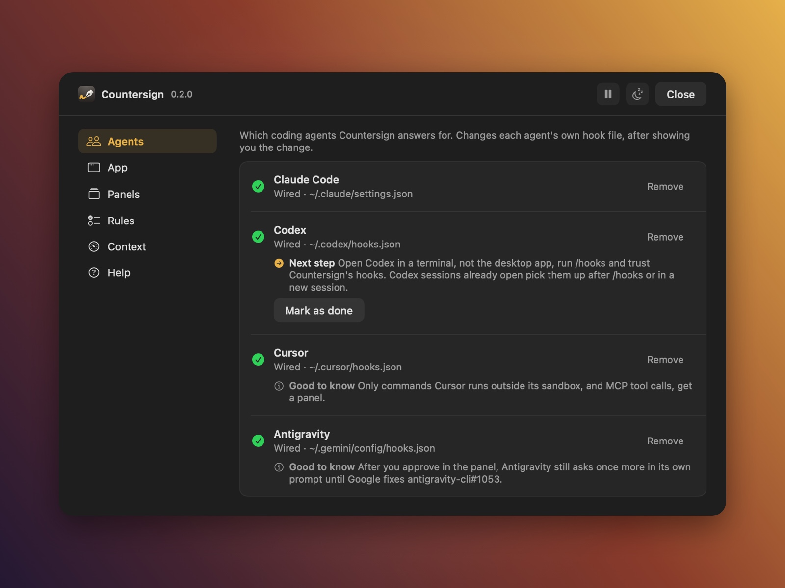<br>
      <b>Settings, no terminal needed.</b> Wire, update or remove hooks, tune panels, see the status.
    </td>
  </tr>
  <tr>
    <td>
      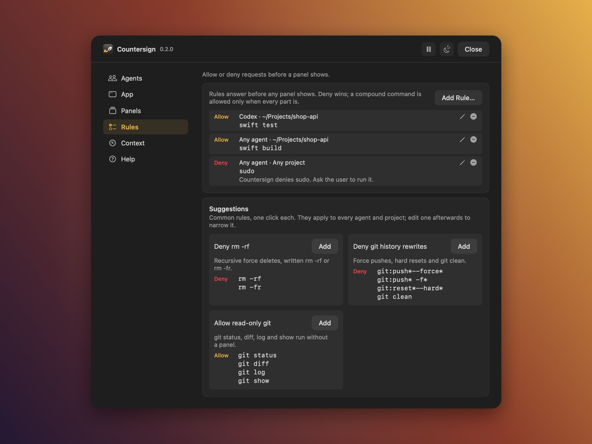<br>
      <b>Allow and deny rules.</b> Routine requests answered before any panel, with one-click suggestions.
    </td>
    <td>
      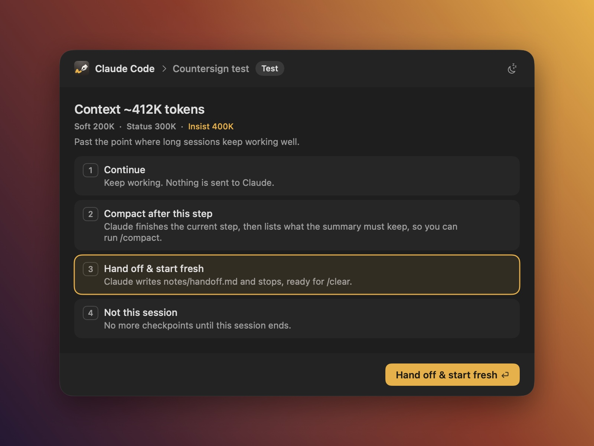<br>
      <b>Context checkpoints.</b> Compact or hand off before a Claude Code session runs long.
    </td>
  </tr>
  <tr>
    <td width="50%">
      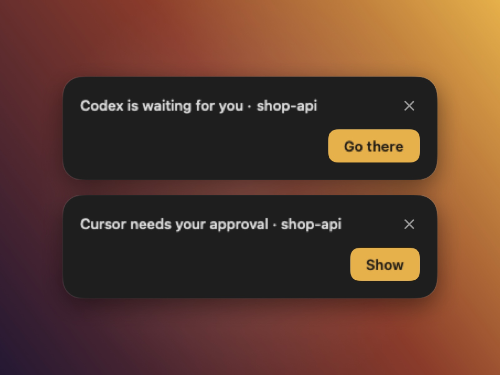<br>
      <b>Corner cards.</b> A notice when an agent is waiting, and a card when an approval is stuck behind your typing.
    </td>
  </tr>
</table>

## Features

- **Waits for a pause.** A panel appears only once you stop typing, clicking or scrolling (5
  seconds by default), so it never lands in the middle of a sentence.
- **Behaves like an alert.** <kbd>Return</kbd> approves, <kbd>⌫</kbd> opens the deny step (Keep
  planning for a plan), <kbd>Esc</kbd> hands the prompt back to the chat, and nothing you type
  leaks into the app underneath, even after <kbd>⌘</kbd><kbd>Tab</kbd>. Keys and clicks in its
  first 500 ms are ignored.
- **Leaves your place alone.** It takes the keyboard without activating its own app; when it
  closes, your editor or chat gets its caret and selection back exactly where they were.
- **Knows when you already answered.** Reply in Claude Code's chat and the panel, or the queued
  request, drops out within about a second; reply within the grace period (off by default) and no
  panel appears at all.
- **Real context for edits.** The enclosing function or block, real line numbers, and "Show N
  unchanged lines" rows that expand up to the whole file. Codex patches get the same treatment.
- **Approve, or deny with a reason.** Approve's ▾ menu holds the "Always allow" rules Claude Code
  suggests, each with the exact rule and where it is saved; for Codex, **Always allow** saves a
  Countersign rule for that project. Deny takes a reason, and for Claude Code also offers
  **Deny & stop**.
- **Allow and deny rules.** A rule answers a request before any panel shows: allow lets it
  through, deny blocks it and tells the agent why. Narrow a rule by agent, project, tool or
  command; deny always wins, and a compound command is allowed only when every part is. Add them
  in Settings ▸ Rules, or pick a suggestion such as deny `sudo`; see
  [Allow and deny rules](docs/configuration.md#allow-and-deny-rules).
- **Questions and plans.** Claude's `AskUserQuestion` as tabs with numbered options, multi-select,
  an Other field and an optional note (off by default); plans as Markdown, with the mode Claude
  continues in.
- **Snooze.** Quiet for a preset duration. Requests answered in their chats meanwhile drop out, the
  rest come back one at a time.
- **Scheduled quiet hours.** Recurring windows, such as weekday evenings, in which panels wait
  like a snooze. Set them in Settings ▸ Panels; see
  [Quiet hours](docs/configuration.md#panels).
- **A sound cue (optional).** One macOS sound when a panel appears, off by default; see
  [Sound](docs/configuration.md#panels).
- **Waiting-agent notices.** When an agent has finished a turn, or handed a request back
  to its own prompt, and you have been away from it for 10 seconds (by default), a small corner
  card says which agent is waiting, with a **Go there** button. On by default, and it never takes
  focus; see [Waiting-agent notices](docs/configuration.md#panels).
- **Approval cards.** When a request is waiting for you to pause and you keep working, a corner
  card such as "Cursor needs your approval · shop-api" has a **Show** button that brings the panel
  up at once. On by default for Codex, Cursor and Antigravity; see
  [Approval cards](docs/configuration.md#panels).
- **Decision history and menu answers.** The menu-bar app lists your last ten answers, and lets you
  deny a pending request, hand it back to its chat, or bring its panel up with **Show Now**, even
  during a snooze, without waiting for a pause; see
  [the menu-bar app](docs/menu-bar-app.md#pause-snooze-and-pending-requests).
- **Accessible.** Panels announce themselves to VoiceOver, read shortcuts and diff lines aloud, and
  honour Reduce Motion and Increase Contrast; see [design/panel.md](docs/design/panel.md#accessibility).
- **Context checkpoints (Claude Code).** Countersign asks, at three
  context sizes, whether to compact or hand off before your session gets too long, without ever
  making a prompt wait. On by default; turn it off in Settings ▸ Panels; see
  [Context checkpoints](docs/configuration.md#context-checkpoints-claude-code).
- **Fails safe.** Any error, timeout or crash means "no decision": the agent falls back to its own
  prompt, and Cursor and Antigravity carry on as they would without Countersign.
- **Cursor too.** Shell commands Cursor runs outside its sandbox, and every MCP tool call, get the
  same panel. Commands inside Cursor's sandbox are left to Cursor. Until Cursor fixes a hook bug,
  its own run mode still decides after you approve, so in Allowlist mode it asks you again
  ([Limitations](docs/limitations.md)).
- **Antigravity too.** Every command and MCP tool call from the `agy` CLI, the Antigravity app and
  the IDE; reading files, edits and its other tools are left to Antigravity. Until Google fixes a
  hook bug, it still asks you itself after you approve ([Limitations](docs/limitations.md)).
- **A menu-bar app, if you want one.** On, paused or quiet at a glance, with Pause, Snooze,
  Settings, a test panel to try your settings on, Launch at Login, the update check and Help.
  Quitting it asks whether to keep showing panels or pause them until you reopen it. Approvals work
  the same without it.
- **Settings without the terminal.** One resizable window has Pause and Snooze buttons in its
  header and shows when Countersign is paused or quiet, with a sidebar for Agents, App, Panels and Help, plus Advanced behind a button in App: wire,
  update or remove each agent's hooks, tune panels and try them on a test panel. Every hook change
  shows its diff first, and every other change is saved as soon as you make it; any setting that's
  been changed can be reset to its default, alone or as a group.
- **Checks its own setup.** `countersign doctor` prints a plain, pasteable report, the same one a
  bug report asks for. Doctor and Settings also warn when more than one copy of Countersign is
  installed, and Settings walks you through keeping the one you choose.

## Using it

While a panel is on screen it owns the keyboard. Switch apps or type a key it has no use for, and
it steps aside, swallowing that one key, until your next pause. ⌘ shortcuts such as ⌘C still work.

| To | Do |
| --- | --- |
| Approve once | <kbd>Return</kbd>, or **Approve** |
| Approve and remember | **Approve ▾** or <kbd>⌘</kbd><kbd>Return</kbd>, then pick a rule |
| Deny | <kbd>⌫</kbd> or **Deny** opens a reason field, optionally type a reason, then <kbd>Return</kbd> for **Deny**, or <kbd>⌘</kbd><kbd>Return</kbd> / **Deny & stop** (Claude Code only) |
| Hand it back to the chat | <kbd>Esc</kbd>, **Answer in chat**, or click anywhere outside the panel |
| Pick an answer | <kbd>1</kbd>–<kbd>9</kbd>, <kbd>←</kbd> <kbd>→</kbd> between questions, <kbd>Return</kbd> for the next question and then **Submit** |
| Approve a plan | Choose the mode in **then: …** (<kbd>⌘</kbd><kbd>Return</kbd> opens it; it starts on your **Mode after a plan** setting), then <kbd>Return</kbd> |
| Send plan feedback | <kbd>⌫</kbd> or **Keep planning** opens a feedback field, type, then <kbd>Return</kbd> |
| New line in a text field | <kbd>Shift</kbd><kbd>Return</kbd> |
| Get some quiet | **Snooze ▾** in the header |
| Choose in a ▾ menu | <kbd>↑</kbd> <kbd>↓</kbd> and <kbd>Return</kbd>, or <kbd>1</kbd>–<kbd>9</kbd>; <kbd>Esc</kbd> closes just the menu; <kbd>⌘</kbd><kbd>Return</kbd> closes it too |

| Command | What it does |
| --- | --- |
| `countersign setup` | Opens the setup window; `setup --cli` does the same in the terminal |
| `countersign settings` | Opens the same window |
| `countersign doctor` | Checks your setup and prints a plain, pasteable report |
| `countersign status` | Active or paused, queued requests, quiet time, log location |
| `countersign pause` / `resume` | Turn the panel off and on. While paused, every prompt goes to its chat |
| `countersign snooze 15m` | Quiet time for all prompts. Accepts `90s`, `15m`, `1h` or plain minutes |
| `countersign snooze off` | End quiet time early |
| `countersign test-panel` | Shows a test panel with your settings; add `question`, `plan` or `context` for those. Nothing reaches an agent |
| `countersign --version` | Prints the installed version |
| `countersign help` | Lists every command, with the help and support links |

What each answer does in each agent: [docs/agents.md](docs/agents.md). `preview` and `snapshot`,
for rendering a request without an agent, are covered in [CONTRIBUTING.md](CONTRIBUTING.md).

## Configuration

Settings live in `~/.config/countersign/config.json` (or `$XDG_CONFIG_HOME/countersign/config.json`),
for example `{ "idleSeconds": 8, "graceSeconds": 3 }`. The file is optional; every setting has a
default, and most can be set per agent. Every key: [docs/configuration.md](docs/configuration.md).

## Privacy

- No account, and no telemetry: nothing about your requests, commands, file contents, answers or
  deny reasons is sent anywhere or written to the log.
- The one network request Countersign can make, the update check, is off unless you turn it on or
  choose **Check for Updates…**; it fetches a static `releases/index.json` with no cookies, query
  or body, and never installs anything. The hook, setup, doctor and the panel never touch the
  network.
- Everything else stays on your Mac: the config file, the request queue, the log and the agents'
  own hook files it edits (each backed up first). See what it reads and writes:
  [docs/safety-and-privacy.md](docs/safety-and-privacy.md).
- Any error, crash or timeout means "no decision", never an approval.

The CLI and app are only ad-hoc signed, not notarized: a `curl | sh` install never passes through a
browser download, so nothing sets Gatekeeper's quarantine flag and there's nothing to work around
(see [docs/release.md](docs/release.md#why-ad-hoc-signing-and-no-notarization)).

## Help

- **Something not working?** Run `countersign doctor` and see
  [docs/troubleshooting.md](docs/troubleshooting.md); known gaps are in
  [docs/limitations.md](docs/limitations.md).
- **Found a bug?** Open a [bug report](https://github.com/Gord1y/countersign/issues/new?template=bug.yml)
  with the output of `countersign doctor`.
- **Have a question?** Ask in
  [Discussions](https://github.com/Gord1y/countersign/discussions/new?category=q-a).
- **Found a security issue?** See [SECURITY.md](SECURITY.md) instead of opening a public issue.
- **In the terminal?** `countersign help` lists every command and these links.

## Support

Countersign is free and open source. If it saves you time, you can support it on
[GitHub Sponsors](https://github.com/sponsors/Gord1y) or
[Buy Me a Coffee](https://buymeacoffee.com/gord1y). Settings ▸ Help, the menu-bar app and
`countersign help` link there too.

## Contributing

See [CONTRIBUTING.md](CONTRIBUTING.md) for building, the gates a change must pass and the commit
rules; first-time contributors sign the [CLA](CLA.md). Every other page, including the design notes
and the [roadmap](ROADMAP.md), is indexed in [docs/README.md](docs/README.md).

## License

GPL-3.0-only. See [LICENSE](LICENSE).
