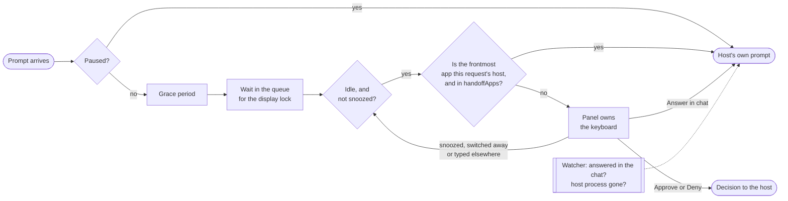

# How it works

This page is the map of how Countersign gets from a prompt to a decision, and the index of the
design notes that explain each part and why it works the way it does. Read it first when you are
about to change how the hook, the queue, the panel or a host adapter behaves, then follow the link
to the part you are changing.

Every prompt starts a short-lived `countersign hook` process. It either prints one decision for the
host or exits silently, and exiting silently always means "no decision": Claude Code and Codex show
their usual prompt, and Cursor and Antigravity carry on as they would without Countersign. When the
person hands a Cursor or Antigravity request back to its chat, the hook prints `ask` instead, so
that the host shows its prompt too.

Grace, idle and the handoff list are config-driven (see [configuration](../configuration.md)) rather than
fixed durations: `graceSeconds`, `idleSeconds` and `handoffApps` each fall back to a built-in
default and can be set per host. The handoff gate fires only when the frontmost app's bundle
identifier is in `handoffApps` *and* that frontmost app is also the one this request came from
(see "Why the handoff rule is per-app" in [hosts](hosts.md)), and it is checked when the panel
would appear, not when the request arrives (see "Handing off to the asking app" in
[panel](panel.md)).

- **Queue.** Each waiting prompt writes a small ticket file. Only the oldest live ticket that also
  holds an exclusive `flock` may show a panel, so two panels can never be on screen together, and a
  crashed process releases its place automatically. When you answer a panel, the next prompt in
  line shows right away on the same dimmed screen, without the idle wait. Details in
  [queue](queue.md).
- **Watcher.** While a prompt waits or is on screen, Countersign watches Claude Code's session state
  and transcript for the same request being answered in the chat, and watches for its parent
  process disappearing. Details in [resolution](resolution.md).
- **Panel.** A borderless, non-activating `NSPanel` with SwiftUI content, centered on the display
  under your mouse over a softly blurred backdrop. Details in [panel](panel.md).
- **Hosts.** One adapter per host translates requests in and decisions out. Codex supports only
  allow and deny. Cursor supports allow, deny and ask: it is asked only about shell commands it
  runs outside its sandbox and about MCP tools, "Answer in chat" answers it with `ask` so it shows
  its own prompt, and its hook hands back with `ask` a minute before Cursor's timeout, since Cursor
  lets a command run when its hook times out. Antigravity calls the hook before every tool call and
  gets the same treatment: a panel only for commands and MCP tools, `ask` for "Answer in chat" and a
  minute before its timeout. It still asks the person itself after an Approve until it fixes
  google-antigravity/antigravity-cli#1053. Details in [hosts](hosts.md).

The app icon is outside this flow; how it was drawn, why its accent is amber and how the panel's
header draws the same mark in code are in [icon](icon.md).
