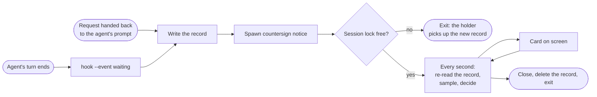

# Waiting notices

When an agent ends its turn and waits for you, and you are somewhere else, Countersign shows a small
card in the top-right corner of the active display: `<Agent> is waiting for you · <project>`, with a
`Go there` button and a close button. It never takes focus and never plays a sound. This page is
how that card gets there, why each piece works the way it does, and what it deliberately does not
do.

## The flow



Every host's waiting entry runs `countersign hook --host <host> --event waiting` (see "The
waiting-agent entry" in [setup.md](setup.md)), so the command line, not the payload, says the turn
ended. `HookRunner.run` branches on `HookOptions.event` after the config load and the stdin read and
before the pause check: pause holds a notice, it never drops one, so a paused Countersign still
writes the record and the notice process waits for the pause to end.

The hook then:

1. parses the envelope with `WaitingEnvelope.parse(_:host:)` (fail: `waiting: unparseable input`);
2. stops if `waitingNotices` is off (`waiting: notices off`);
3. for Claude Code, looks the session up in the session registry and stops when
   `HeadlessSessionGate.decide(registryEntry:includeHeadlessSessions: false)` skips it (`waiting:
   skipped non-interactive session`): a `claude -p` run or an SDK session has nobody to wait for,
   whatever `includeHeadlessSessions` says about approvals;
4. writes the record, spawns the notice process and logs `waiting: recorded <host> <project>`.

It always exits 0 with empty stdout, like every other `hook` path.

## The record

`WaitingRecord` is one JSON file per session in `AppPaths.waitingDirectory`
(`~/Library/Application Support/Countersign/waiting`), named `<host>-<key>.json`. The key is the
session id with every character outside `[A-Za-z0-9._-]` replaced by `_`, cut to 80 characters, so
no session id can reach outside the directory or make an unusable file name. It holds the host, the
session id, the project's name and path, the transcript path when the host sent one, the reason
(`turnEnded` or `handedBack`), `recordedAt`, the agent's app (bundle id, pid and name, from
`HostApp.resolve()`) and the agent process (pid and start time).

`WaitingStore.save` writes a temporary file next to the record and renames it over the old one, the
same way `CodexHookTrustRecordStore.save` does, so a reader sees the old record or the new one and
never half of either. `load` returns `nil` for a missing file, unreadable JSON or a missing field.

The agent process is the first ancestor of the hook that is not a shell (`sh`, `bash`, `zsh`,
`dash`, `fish`). A captured Claude Code Stop hook ran under `sh` → `claude` → `zsh` → `claude` (the
Cursor extension's binary) → `Cursor Helper` → `Cursor.app`, so that walk finds `claude`, while
`HostApp.resolve()` finds Cursor. Its start time comes from `ProcessLiveness.startTime(of:)`, so a
reused pid is not mistaken for the agent.

### Hand-back records

A request handed back to the agent's own prompt leaves the agent waiting just as a finished turn
does, so the approval path writes a record too, with reason `handedBack`, built from the
`ApprovalRequest` and the host app the hook already resolved. It does that only for `mode == .hook`
with `waitingNotices` on (never for a test panel or a context checkpoint), after the reply is
written and the ticket removed, from every place a request goes back to the agent's prompt: both
`handBack` functions (the timeout hand-back while queued and while shown),
`handOffIfAskingAppIsFrontmost`, and an Answer in Chat from the panel or the menu (`finish` or the
queued menu answer with `.noDecision`). It logs `waiting: recorded <host> <project> (handed back)`.

A Claude subagent's request carries the main session's `transcript_path` and an `agent_id`, and the
main transcript does not grow until the subagent finishes. So when the request has an `agentID`
and `<transcript path without .jsonl>/subagents/agent-<agentID>.jsonl` exists
(`SubagentChainReader.transcriptPath(mainTranscriptPath:agentID:)`), the record watches that file;
otherwise it watches the request's transcript path.

## Starting the notice

The hook starts `countersign notice <record file>` with `posix_spawn` of its own executable and
never waits for it:

- `POSIX_SPAWN_SETSID` puts the notice in its own session and process group. Hosts may kill the
  hook's process group when it times out; the notice must outlive the hook by minutes or hours.
- `POSIX_SPAWN_CLOEXEC_DEFAULT` closes every descriptor the child did not ask for, and file actions
  open `/dev/null` on 0, 1 and 2. Hosts wait for EOF on the hook's stdout and stderr: a child that
  inherited either pipe would keep the agent's turn open for as long as the notice lives.

The hook always spawns, even when a notice for the session is already running. It never checks the
lock itself: the notice process takes it, so there is one place that decides.

`notice` is a `main.swift` case, absent from the usage line and from `countersign help`: nobody runs
it by hand. It redirects stderr to the event log and always exits 0.

## One notice per session: the lock and the newer record

The notice process loads the record and takes `WaitingStore.lockFile(for:)`
(`<host>-<key>.lock`) with `ExclusiveFileLock.acquire`. If another notice holds it, it exits at
once. That is safe because the holder re-reads the record every tick: a newer `recordedAt` makes it
start over for the new record, with its reason, a new transcript baseline and the card hidden.

Closing has a race with a hook writing a newer record at the same moment. The holder handles it in
this order:

1. re-load the record; if it is newer than the one it acted on, start over instead of exiting (the
   hook that wrote it found the lock held and counted on this process);
2. otherwise delete the record, since it is the one it acted on;
3. release the lock, then load once more: a record that arrived after the delete, whose notice
   found the lock still held and exited, is picked up by re-taking the lock. If the new notice took
   the lock first, the holder exits and leaves it to that one.

What remains is a record renamed into place between the re-load in step 1 and the delete in
step 2, a window of microseconds; the hook's next record for that session brings the notice back.

## The clock

`WaitingNoticeClock.decide(_:)` is a pure decision from one `WaitingNoticeSample`: now,
`recordedAt`, the delay (`waitingNoticeMinutes`, 2 by default), whether the card is shown, whether
the agent process is alive, pause, quiet time, whether the agent's app is frontmost, when it last
was, whether a live ticket belongs to the session, and whether the transcript shows a resume. The
rules, in order:

1. the agent process is gone: close, `agent exited`;
2. the record is older than 12 hours: close, `expired`;
3. the agent resumed: close, `resumed`;
4. shown, and the agent's app is frontmost: close, `in the agent's app` (you got there yourself);
5. shown, and paused or in quiet time: hide (`paused` or `quiet`). The card comes back when that
   ends, because the notice is due by then;
6. not shown: held while paused, in quiet time, in the agent's app, or while a Countersign ticket
   for this session is live (a panel for the session is its own notice); otherwise shown once due.

The notice is due at `max(recordedAt, lastAgentAppFrontmostAt) + delay`. Being in the agent's app
counts as having seen it, so leaving that app restarts the wait rather than showing the card at
once. With no app recorded, the notice never counts as in the agent's app. An agent process that
could not be found counts as alive: unknown is never a decision.

A live ticket belongs to the session when its host matches and the recorded agent pid is among the
ticket process's ancestors (the hook that wrote the ticket runs under the same agent). With no agent
pid recorded, the project name stands in.

### The 12-hour cap

A notice process that nobody dismisses and whose agent never exits would otherwise live forever.
Twelve hours covers a working day and a night; an agent that has waited longer is not waiting for a
reminder.

## Resume detection

The hook does not run when the person answers the agent, so the notice watches the transcript.
`TranscriptGrowth.settleSeconds` is 10: the baseline is the transcript's size first sampled at least
10 seconds after `recordedAt`, and growth past it is read, at most 1 MB
(`TranscriptGrowth.maximumReadBytes`), and handed to `TranscriptGrowth.resumed(host:appended:)`.

For Claude Code, raw growth is not a resume. Measured on real transcripts, untimestamped metadata
rows (`last-prompt`, `ai-title`, `atis-latch`, `cost-state`, `mode`) are appended after the
`end_turn` assistant row, and a new message arrives as `queue-operation` rows plus a `user` row. So
a resume is a complete line, one that ends in `\n`, whose JSON `type` is `user`, `assistant` or
`queue-operation`. A partial last line waits for the next tick. For Codex, Cursor and Antigravity,
whose transcript rows have not been captured, any growth counts.

No transcript path, a missing file or an unreadable one means never resumed: the notice then ends
by the other rules. A file that shrinks resets the baseline.

There are three resume signals:

1. transcript growth, as above;
2. any Countersign hook for the session. In `HookRunner.run`, right after stdin is read and before
   the pause check, every invocation whose event is not `waiting` parses only the
   `WaitingEnvelope` and deletes that session's record with `WaitingStore.deleteRecord(host:
   sessionID:)` (an unlink by name, no load; a missing file is fine). Antigravity's PreToolUse runs
   on every tool call and Cursor's hooks on every shell and MCP call, so a hook for the session
   means the agent is working again. It logs `waiting: <host> <project> working again` when a file
   was removed. The notice already closes when its record is gone, and logs
   `notice: closed (working again)`;
3. a newer record, which starts the notice over.

### Codex rollout lookup

Every captured Codex and Antigravity payload sends the transcript path as null, so signal 1 would
never fire for them. Codex keeps each session's transcript at
`$CODEX_HOME/sessions/YYYY/MM/DD/rollout-<local time>-<session id>.jsonl` (`CODEX_HOME` defaults to
`~/.codex`). For a Codex record whose envelope has no transcript path, `WaitingRecorder` calls
`CodexRolloutLocator.find(sessionID:sessionsDirectory:maxDays:)`. It lists year, month and day
folders newest first (names that are not numbers are skipped) and looks in at most 14 day folders
for a regular file named `rollout-*-<sessionID>.jsonl`. The day folder is the session's start day,
so a session that started more than 14 day folders ago is not found; its notice then ends by the
other rules, and signal 2 still applies. The lookup applies to both record kinds, a turn-end record
and a hand-back record. Any listing error means no path. Antigravity has no known
transcript location, so it relies on signal 2.

## The card

The notice is a `CornerCard` (`Sources/countersign/CornerCard.swift`), a borderless,
non-activating `NSPanel` (`CornerCardPanel`) that cannot become key or main, at the approval panel's level (`ApprovalPanel.floatingLevel`) with
`.canJoinAllSpaces` and `.fullScreenAuxiliary`, so it shows over full-screen apps on every Space.
It draws the panel's surface (the regular material), corner radius, border (stronger under Increase
Contrast) and body type, 340 pt wide. Its hosting view accepts the first mouse click, so `Go there`
and the close button work although the window is never key and the process never active.

The process is launched through `PanelApplication`, which shows nothing before
`applicationDidFinishLaunching` and keeps its activation guard (see "Never activating" in
[panel.md](panel.md)); the card only orders itself front with `orderFrontRegardless`.

Placement: the top-right corner of `PanelController.resolveTargetScreen()`'s visible frame, inset
16 pt, resolved each time the card shows. Several sessions stack: a notice takes the lowest free
`slot-<n>.lock` for n in 0...3 and sits n × (card height + 8 pt) lower. With all four taken it stays
unshown and tries again each tick; it releases its slot when it hides or closes. On a display
change it moves to the top-right corner of the screen that now holds it, the way the result card
follows (see "The result card" in [panel.md](panel.md)).

### The shared corner card

The waiting notice and the approval card (see "The approval card" in [panel.md](panel.md)) are
the same `CornerCard` with different content, so they look alike, stack in one column and never
overlap. Everything above is the shared part: the panel, the view, the fade, the announcement,
the placement, following screen changes and the slots. `CornerCard.inFreeSlot(of:...)` takes the
lowest free `slot-<n>.lock` in `AppPaths.waitingDirectory` and returns nil when all four are taken;
the card owns that lock and releases it in `close()`, so closing a card always frees its slot and
an exiting process frees it with its file descriptor. The slots are shared across every notice
process and every hook process, so a notice and an approval card on screen at once take different
slots.

Only `CornerCardModel` differs: a lead text, the project name, and an optional action title.
`CornerCardModel.waitingNotice` gives `<Host.displayName> is waiting for you · ` and `Go there`
(none without a recorded app); `CornerCardModel.approval` gives `<Host.displayName> needs your
approval · ` and `Show`. Each caller passes its own accessibility title, `Countersign notice` or
`Countersign approval`.

Content: one line, `<Host.displayName> is waiting for you · <projectName>`, where only the project
truncates, in the middle, so the start and the end of a long name stay readable. `Go there` is
hidden when no app was recorded. It opens the recorded pid's `bundleURL` when that process is alive
with the same bundle id, otherwise the app found by bundle id, through
`NSWorkspace.openApplication(at:configuration:)` with `activates = true`, and closes the notice in
the completion handler. `NSRunningApplication.activate(options:)` is not used: under macOS 14's
cooperative activation the system may ignore it from a process that is not active, and the notice
never is. Launch Services brings a running app forward from a background process. The close button
is an `xmark` with the accessibility label `Dismiss`. On show, the card posts an accessibility
announcement with the line and fades in over 0.15 s unless Reduce Motion is on. No sound: only
`PanelController` plays `panelSound` (see "Sound when a panel appears" in [panel.md](panel.md)).

## Log lines

Names only, never message text:

- `waiting: recorded <host> <project>` and `... (handed back)`, `waiting: unparseable input`,
  `waiting: notices off`, `waiting: skipped non-interactive session`, and on a failure
  `waiting: failed to record: <error>` or `waiting: failed to start the notice`;
- `notice: waiting <host> <project> (<reason>)` when a notice starts or starts over;
- `notice: shown`;
- `notice: held (paused|quiet|in the agent's app|panel open)`, only when the reason changes;
- `notice: hidden (paused|quiet)`;
- `notice: closed (resumed|go there|dismissed|agent exited|expired|in the agent's app|working again)`;
- `waiting: <host> <project> working again` when a Countersign hook deleted the session's record.

## Snapshots

```sh
.build/debug/countersign snapshot --waiting-notice claude|codex|cursor|antigravity \
  [--project <name>] [--no-app] [--appearance light|dark] -o <out.png>
```

It draws `CornerCardView` with the solid surface, offscreen, the same way the tour snapshot does
(see "Snapshots" in [panel.md](panel.md)). The project defaults to `shop-api`; `--no-app` renders
the card without `Go there`, as for a record with no app.

```sh
.build/debug/countersign snapshot --approval-card claude|codex|cursor|antigravity \
  [--project <name>] [--appearance light|dark] -o <out.png>
```

draws the approval card the same way, with `Show`.
